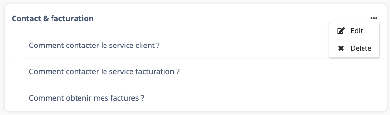
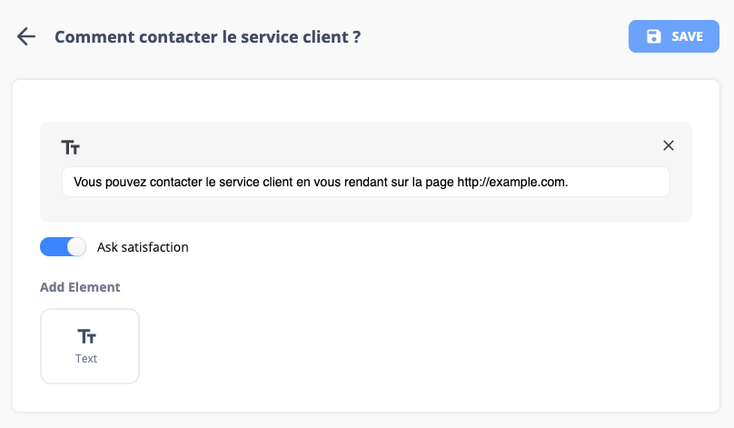
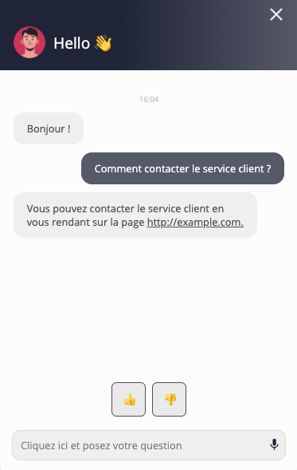

# TCF

install

    cd frontend; yarn install
    cd server; yarn install

## TCF Tech Challenge

### Context

Our product owner Ulysse has been working hard to understand
what our clients, users of our chatbot automation platform, do need in priority.

It appears that a first step would be to let them manage
easily their base of knowledge of questions & answers
(currently, they are doing it through a spreadsheet that we must
import into our database manually and it's not very convenient).

Ulysse (which is also our designer) has produced some
great interface designs for this feature.

**Questions list:**

The questions list is an area that is used to organised
multiple questions into an intelligible category.

The category has a feature to let the user rename it or delete
it with its associated questions.

The user can access the Answer form by selecting a specific question.

**Answer form:**

The answer form allow our user to add successive blocks of
text that will be used by the chatbot to produce an answer
when a specific question is asked.

In this design, the user can:

* go back to the questions list;
* save the answer;
* add text elements to the answer by selecting the text button
(other elements might be added in a future release);
* remove a text block by hitting the cross at its right top corner;
* toggle an "Ask satisfaction" button that will allow the
chatbot to get feedback from the chatbot user about the quality of the answer.

**Webchat preview:**

The preview of the actual webchat window looks like this:

### Guidelines

* You must create a tiny fullstack (server and client)
TypeScript application that implements the specified feature.
* Spend about 3-4 hours on the challenge, we don't expect you to finish.
You must priorize your work and focus on what will give the most value to the user.
* We do expect the code you produce to be clean, maintainable and robust.
* Split your work into readable commits (the history must be clean for the reviewer).
* You're free to add any package that could help you.
However, Ulysse has plenty of customization ideas we
might implement later and we do not want to be tighted
to a specific UI library for example.
* Open an issue with the public link(s) of your work.
We will look at the Git history and the hour of your
issue to estimate the time spent on this challenge.
